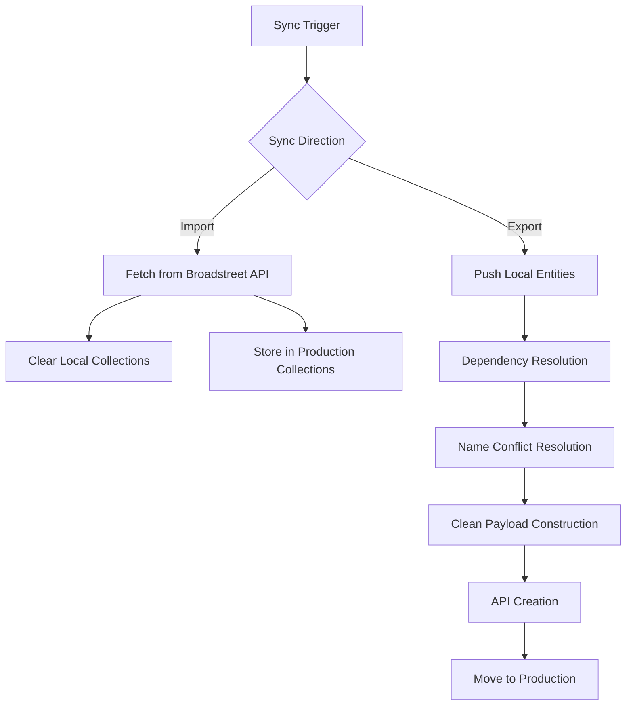

# Sync System

**Feature**: Bidirectional synchronization between local entities and Broadstreet API  
**Purpose**: Maintain data consistency while enabling local-first entity management  

## 🎯 Overview

The Sync System handles the complex process of synchronizing data between local MongoDB collections and the Broadstreet API. It supports both directions: importing data from Broadstreet and exporting locally created entities to Broadstreet.

## 🔄 Sync Directions

### **1. Broadstreet → Local (Import)**
Fetch data from Broadstreet API and store in local production collections.

### **2. Local → Broadstreet (Export)**
Push locally created entities to Broadstreet API and move to production collections.

## 🏗️ Architecture

### **Sync Flow Overview**


### **Dependency Hierarchy**
```
Level 1: Networks (no dependencies)
Level 2: Advertisers, Zones (depend on Networks)
Level 3: Advertisements (depend on Networks, Advertisers)
Level 4: Campaigns (depend on Advertisers)
Level 5: Placements (depend on Campaigns, Advertisements, Zones)
```

## 📊 Sync Types

### **Individual Entity Sync**
Sync specific entity types independently.

**Endpoints:**
- `POST /api/sync/networks`
- `POST /api/sync/advertisers`
- `POST /api/sync/zones`
- `POST /api/sync/campaigns`
- `POST /api/sync/advertisements`
- `POST /api/sync/placements`

### **Batch Sync Operations**

#### **Import All (`POST /api/sync/all`)**
Import all entities from Broadstreet API in dependency order.

```typescript
const syncAll = async () => {
  const results = {};
  
  // Step 1: Networks (no dependencies)
  results.networks = await syncNetworks();
  
  // Step 2: Parallel sync of dependent entities
  const [advertisersResult, zonesResult] = await Promise.all([
    syncAdvertisers(),
    syncZones()
  ]);
  results.advertisers = advertisersResult;
  results.zones = zonesResult;
  
  // Step 3: Advertisements (depend on networks, advertisers)
  results.advertisements = await syncAdvertisements();
  
  // Step 4: Campaigns (depend on advertisers)
  results.campaigns = await syncCampaigns();
  
  // Step 5: Placements (depend on campaigns, advertisements, zones)
  results.placements = await syncPlacements();
  
  return results;
};
```

#### **Export All (`POST /api/sync/local-all`)**
Export all local entities to Broadstreet API with dependency resolution.

```typescript
const syncLocalAll = async () => {
  const idMaps = {
    networks: new Map(),
    advertisers: new Map(),
    zones: new Map(),
    advertisements: new Map(),
    campaigns: new Map()
  };
  
  // Step 1: Resolve name conflicts
  const resolvedNames = await resolveAllNameConflicts();
  
  // Step 2: Sync in dependency order
  await syncLocalNetworks(idMaps, resolvedNames);
  await syncLocalAdvertisers(idMaps, resolvedNames);
  await syncLocalZones(idMaps, resolvedNames);
  await syncLocalAdvertisements(idMaps, resolvedNames);
  await syncLocalCampaigns(idMaps, resolvedNames);
  
  return { idMaps, results };
};
```

## 🔧 Core Components

### **1. Dependency Resolution**

```typescript
const resolveDependencies = async (entities, entityType, idMaps) => {
  return entities.map(entity => {
    const resolved = { ...entity };
    
    // Map local IDs to API IDs
    switch (entityType) {
      case 'advertisers':
        resolved.network_id = idMaps.networks.get(entity.network_id.toString());
        break;
      case 'campaigns':
        resolved.advertiser_id = idMaps.advertisers.get(entity.advertiser_id.toString());
        break;
      case 'zones':
        resolved.network_id = idMaps.networks.get(entity.network_id.toString());
        break;
    }
    
    return resolved;
  });
};
```

### **2. Name Conflict Resolution**

```typescript
const resolveNameConflicts = async (entities, entityType) => {
  const resolvedNames = new Map();
  
  for (const entity of entities) {
    let uniqueName = entity.name;
    let counter = 1;
    
    // Check if name exists in Broadstreet API
    while (await checkEntityExists(uniqueName, entityType, entity.network_id)) {
      uniqueName = `${entity.name} (${counter})`;
      counter++;
    }
    
    if (uniqueName !== entity.name) {
      resolvedNames.set(entity._id.toString(), uniqueName);
      console.log(`🔄 Name conflict resolved: "${entity.name}" → "${uniqueName}"`);
    }
  }
  
  return resolvedNames;
};
```

### **3. Clean Payload Construction**

```typescript
const buildCleanPayload = (entity, entityType, resolvedNames) => {
  // Start with required fields only
  const payload = {
    name: resolvedNames.get(entity._id.toString()) || entity.name
  };
  
  // Add entity-specific required fields
  switch (entityType) {
    case 'advertisers':
      payload.network_id = entity.network_id;
      break;
    case 'campaigns':
      payload.advertiser_id = entity.advertiser_id;
      payload.start_date = entity.start_date;
      break;
  }
  
  // Only add optional fields if they have values
  if (entity.web_home_url?.trim()) {
    payload.web_home_url = entity.web_home_url.trim();
  }
  if (entity.notes?.trim()) {
    payload.notes = entity.notes.trim();
  }
  
  return payload;
};
```

### **4. Entity Lifecycle Management**

```typescript
const syncEntityToAPI = async (localEntity, cleanPayload, entityType) => {
  try {
    // 1. Create in Broadstreet API
    const apiResult = await broadstreetAPI.create(entityType, cleanPayload);
    
    // 2. Create in production collection
    await ProductionModel.create({
      ...localEntity.toObject(),
      id: apiResult.id,
      synced_with_api: true,
      synced_at: new Date()
    });
    
    // 3. Remove from local collection
    await LocalModel.findByIdAndDelete(localEntity._id);
    
    console.log(`✅ ${entityType} synced: ${localEntity.name} (ID: ${apiResult.id})`);
    return apiResult;
    
  } catch (error) {
    // Keep in local collection with error tracking
    await LocalModel.findByIdAndUpdate(localEntity._id, {
      $push: { sync_errors: error.message },
      last_sync_attempt: new Date()
    });
    
    console.error(`❌ ${entityType} sync failed: ${localEntity.name}`, error);
    throw error;
  }
};
```

## 📋 Sync Scenarios

### **Scenario 1: Fresh Import**
```typescript
// Clear all local data and import from Broadstreet
const freshImport = async () => {
  // 1. Clear all production collections
  await clearAllCollections();
  
  // 2. Import all data from Broadstreet
  const results = await syncAll();
  
  // 3. Update UI state
  revalidatePath('/');
  
  return results;
};
```

### **Scenario 2: Local Entity Export**
```typescript
// Export locally created entities to Broadstreet
const exportLocal = async () => {
  // 1. Get all local entities
  const localEntities = await getAllLocalEntities();
  
  // 2. Resolve conflicts and dependencies
  const prepared = await prepareForSync(localEntities);
  
  // 3. Sync to Broadstreet API
  const results = await syncToAPI(prepared);
  
  // 4. Move successful entities to production
  await moveToProduction(results.successful);
  
  return results;
};
```

### **Scenario 3: Incremental Sync**
```typescript
// Sync specific entities or handle partial updates
const incrementalSync = async (entityType, filters) => {
  // 1. Fetch specific entities from Broadstreet
  const entities = await broadstreetAPI.get(entityType, filters);
  
  // 2. Update or create in local collections
  const results = await upsertEntities(entities, entityType);
  
  // 3. Handle conflicts and merging
  await resolveConflicts(results.conflicts);
  
  return results;
};
```

## 🎨 User Interface Integration

### **Sync Status Indicators**
```tsx
const SyncStatusBadge = ({ entity }) => {
  if (entity.created_locally && !entity.synced_with_api) {
    return (
      <Badge className="bg-orange-500 text-white">
        🏠 Local
      </Badge>
    );
  }
  
  if (entity.synced_with_api) {
    return (
      <Badge className="bg-green-500 text-white">
        ✅ Synced
      </Badge>
    );
  }
  
  return (
    <Badge className="bg-gray-500 text-white">
      📡 API
    </Badge>
  );
};
```

### **Sync Progress Display**
```tsx
const SyncProgress = ({ syncState }) => {
  return (
    <div className="space-y-4">
      {Object.entries(syncState).map(([entityType, progress]) => (
        <div key={entityType}>
          <div className="flex justify-between text-sm">
            <span>{entityType}</span>
            <span>{progress.completed} / {progress.total}</span>
          </div>
          <Progress value={(progress.completed / progress.total) * 100} />
        </div>
      ))}
    </div>
  );
};
```

### **Sync Controls in Sidebar**
```tsx
const SyncControls = () => {
  return (
    <div className="p-4 border-t">
      <h3 className="font-semibold mb-2">Sync Operations</h3>
      <div className="space-y-2">
        <Button onClick={() => syncAll()} className="w-full">
          Import from Broadstreet
        </Button>
        <Button onClick={() => syncLocalAll()} className="w-full">
          Export Local Entities
        </Button>
        <Link href="/local-only">
          <Button variant="outline" className="w-full">
            Manage Local Entities
          </Button>
        </Link>
      </div>
    </div>
  );
};
```

## 🚨 Error Handling

### **Error Categories**
1. **Network Errors**: API unavailable, timeout
2. **Authentication Errors**: Invalid API token
3. **Validation Errors**: Invalid data format
4. **Conflict Errors**: Duplicate names, missing dependencies
5. **Quota Errors**: API rate limiting

### **Error Recovery Strategies**
```typescript
const handleSyncError = async (error, entity, operation) => {
  switch (error.type) {
    case 'NETWORK_ERROR':
      // Retry with exponential backoff
      return await retryWithBackoff(operation, entity);
      
    case 'VALIDATION_ERROR':
      // Log and skip invalid entities
      await logValidationError(entity, error);
      return { skipped: true, reason: error.message };
      
    case 'CONFLICT_ERROR':
      // Attempt automatic resolution
      const resolved = await resolveConflict(entity, error);
      return await operation(resolved);
      
    default:
      // Log and continue with other entities
      console.error('Sync error:', error);
      return { failed: true, error: error.message };
  }
};
```

## 📊 Performance Optimization

### **Batch Operations**
```typescript
// Process entities in batches to avoid overwhelming the API
const syncInBatches = async (entities, batchSize = 5) => {
  const results = [];
  
  for (let i = 0; i < entities.length; i += batchSize) {
    const batch = entities.slice(i, i + batchSize);
    const batchResults = await Promise.all(
      batch.map(entity => syncEntity(entity))
    );
    results.push(...batchResults);
    
    // Respect API rate limits
    await delay(1000);
  }
  
  return results;
};
```

### **Caching and Validation**
```typescript
// Cache API responses to avoid redundant requests
const entityExistsCache = new Map();

const checkEntityExists = async (name, type, parentId) => {
  const cacheKey = `${type}:${name}:${parentId}`;
  
  if (entityExistsCache.has(cacheKey)) {
    return entityExistsCache.get(cacheKey);
  }
  
  const exists = await broadstreetAPI.checkExists(name, type, parentId);
  entityExistsCache.set(cacheKey, exists);
  
  return exists;
};
```

## 🧪 Testing Strategies

### **Unit Tests**
```typescript
describe('Sync System', () => {
  test('resolves name conflicts correctly', async () => {
    const entities = [
      { name: 'Test Advertiser', network_id: 1 },
      { name: 'Test Advertiser', network_id: 1 }
    ];
    
    const resolved = await resolveNameConflicts(entities, 'advertisers');
    
    expect(resolved.size).toBe(1);
    expect(resolved.values()).toContain('Test Advertiser (1)');
  });
  
  test('maintains dependency order during sync', async () => {
    const syncOrder = [];
    const mockSync = (type) => syncOrder.push(type);
    
    await syncAllWithMock(mockSync);
    
    expect(syncOrder).toEqual([
      'networks', 'advertisers', 'zones', 'advertisements', 'campaigns'
    ]);
  });
});
```

### **Integration Tests**
```typescript
test('complete sync flow', async ({ page }) => {
  // 1. Create local entities
  await createLocalAdvertiser(page, 'Test Advertiser');
  
  // 2. Navigate to Local Only page
  await page.goto('/local-only');
  
  // 3. Trigger sync
  await page.click('[data-testid="sync-all-button"]');
  
  // 4. Verify sync completion
  await expect(page.locator('[data-testid="sync-success"]')).toBeVisible();
  
  // 5. Verify entity moved to production
  await page.goto('/advertisers');
  await expect(page.locator('[data-testid="synced-entity"]')).toBeVisible();
});
```

## 📈 Monitoring and Metrics

### **Sync Metrics**
```typescript
const trackSyncMetrics = async (operation, entityType, result) => {
  const metrics = {
    timestamp: new Date(),
    operation,
    entity_type: entityType,
    success: result.success,
    duration: result.duration,
    entities_processed: result.count,
    errors: result.errors?.length || 0
  };
  
  await SyncLog.create(metrics);
};
```

### **Performance Dashboard**
- **Sync success rates** by entity type
- **Average sync duration** trends
- **Common error patterns** and resolutions
- **API rate limit utilization**

---

**Next**: Continue with [Filter System](./filter-system.md) to understand the hierarchical filtering implementation.
