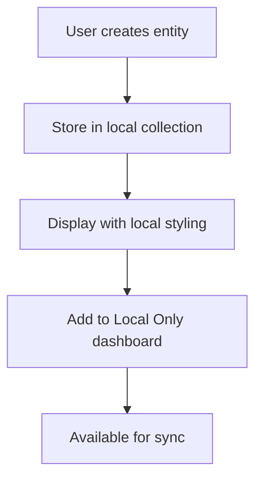
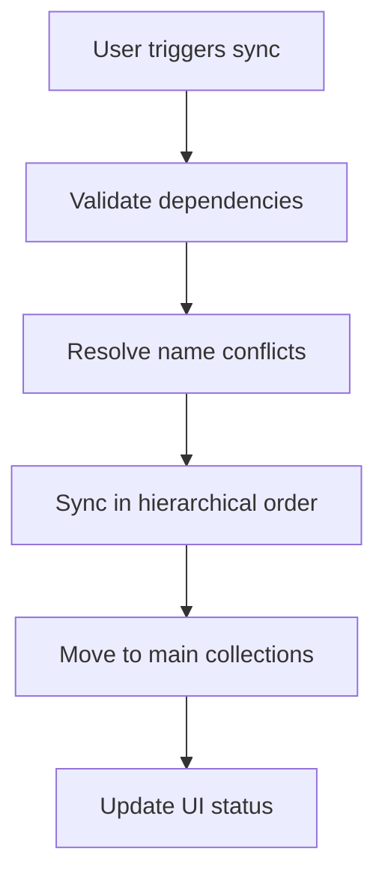

# Application Overview

**Application**: Broadstreet Campaigns  
**Version**: 1.0  
**Purpose**: Modern dashboard for managing advertising campaigns with local entity creation and API synchronization  

## 🎯 Application Purpose

The Broadstreet Campaigns application serves as a sophisticated management interface for advertising campaigns across multiple websites (primarily Schwulissimo.de and TravelM.de). It provides a local-first approach to entity management with seamless synchronization to the Broadstreet advertising platform.

## 🏗️ Architecture Overview

### **Dual-Entity Architecture**
The application operates on a unique dual-entity system:

```
┌─────────────────┐    ┌──────────────────┐    ┌─────────────────┐
│   Local Entities│    │  Sync Process    │    │ Broadstreet API │
│                 │    │                  │    │                 │
│ • local_zones   │────▶│ • Dependency     │────▶│ • networks      │
│ • local_advertisers│  │   Resolution     │    │ • advertisers   │
│ • local_campaigns  │  │ • Conflict       │    │ • zones         │
│ • local_advertisements││   Resolution     │    │ • campaigns     │
│ • local_networks   │  │ • Clean Payloads │    │ • advertisements│
└─────────────────┘    └──────────────────┘    └─────────────────┘
```

### **Technology Stack**

| Layer | Technology | Purpose |
|-------|------------|---------|
| **Frontend** | Next.js 15.5.2 + React 19 | Server-side rendering with App Router |
| **Styling** | Tailwind CSS 4 | Modern utility-first styling |
| **Database** | MongoDB + Mongoose | Document storage with schema validation |
| **API Client** | Axios | HTTP client for Broadstreet API |
| **Validation** | Zod | Runtime type validation |
| **Testing** | Playwright | End-to-end testing |
| **Language** | TypeScript | Type-safe development |

## 📊 Data Model Overview

### **Core Entities**
```
Networks
├── id: number (Broadstreet ID)
├── name: string
├── web_home_url: string
└── logo: object

Zones  
├── id: number (Broadstreet ID)
├── name: string
├── network_id: number → Networks.id
├── alias: string
└── size_type: string

Advertisers
├── id: number (Broadstreet ID)  
├── name: string
├── network_id: number → Networks.id
└── web_home_url: string

Campaigns
├── id: number (Broadstreet ID)
├── name: string
├── advertiser_id: number → Advertisers.id
├── start_date: Date
├── end_date: Date
└── placements: [Placement] (embedded)

Advertisements
├── id: number (Broadstreet ID)
├── name: string
├── type: string
└── preview_url: string

Placements (embedded in Campaigns)
├── advertisement_id: number → Advertisements.id
├── zone_id: number → Zones.id
└── restrictions: string[]
```

### **Local Collections**
Each entity type has a corresponding local collection:
- `local_networks` → `networks`
- `local_zones` → `zones`  
- `local_advertisers` → `advertisers`
- `local_campaigns` → `campaigns`
- `local_advertisements` → `advertisements`

## 🔄 Core Workflow

### **1. Entity Creation**


### **2. Synchronization Process**


### **3. Data Flow**
```
Local Creation → Local Storage → Sync Queue → API Sync → Production Data
```

## 🎨 User Interface Design

### **Navigation Structure**
```
Header (Global)
├── App Title
├── Filter Controls
└── User Actions

Sidebar (Persistent)
├── Dashboard
├── Networks
├── Zones  
├── Advertisers
├── Advertisements
├── Campaigns
├── Placements
├── Local Only
└── Sync Controls

Main Content (Dynamic)
├── Page Header
├── Entity Cards/Lists
├── Filter Results
└── Creation Controls
```

### **Visual Patterns**

**Local Entity Styling**
```css
/* Local entities have distinctive orange styling */
.local-entity {
  background: linear-gradient(to bottom right, #fed7aa, #fdba74);
  border: 2px solid #fb923c;
  box-shadow: 0 4px 6px -1px rgba(251, 146, 60, 0.1);
}
```

**Synced Entity Styling**
```css
/* Synced entities have clean white styling */
.synced-entity {
  background: #ffffff;
  border: 1px solid #e5e7eb;
  box-shadow: 0 1px 3px 0 rgba(0, 0, 0, 0.1);
}
```

## 🔧 Key Features

### **✅ Local Entity Management**
- Create entities without immediate API dependency
- Visual distinction between local and synced entities
- Centralized management via Local Only dashboard
- Batch operations for efficiency

### **✅ Intelligent Sync System**
- Hierarchical dependency resolution
- Automatic name conflict resolution
- Clean API payload construction
- Real-time sync status tracking

### **✅ Advanced Filtering**
- Persistent filter state across pages
- Hierarchical filtering (Network → Advertiser → Campaign)
- Smart filter combinations
- URL-based filter persistence

### **✅ Modern UI/UX**
- Responsive design optimized for all devices
- Server-side components for performance
- Collapsible forms with minimal required fields
- Real-time validation and error handling

### **✅ Placement Creation Utility**
- 6-step wizard for creating fallback advertisements
- Automatic zone matching by size keywords
- Bulk placement creation
- Campaign and advertiser filtering

## 📱 Page Overview

### **Dashboard (`/dashboard`)**
- Entity count cards with navigation
- Recent activity summary
- Quick action buttons
- Sync status overview

### **Networks (`/networks`)**
- Network cards with details
- Website information
- Advertiser and zone counts
- Filter controls

### **Zones (`/zones`)**
- Zone cards with size detection
- Categorization (SQ, PT, LS types)
- Network filtering
- Search by keywords

### **Advertisers (`/advertisers`)**
- Advertiser cards with company info
- Network association
- Campaign counts
- Website links

### **Advertisements (`/advertisements`)**
- Advertisement cards with previews
- Type-based filtering
- Advertiser association
- Active placement status

### **Campaigns (`/campaigns`)**
- Campaign cards with date ranges
- Status indicators (active/inactive)
- Advertiser association
- Placement counts

### **Local Only (`/local-only`)**
- Centralized view of unsynced entities
- Batch sync functionality
- Individual entity management
- Delete operations

## 🔄 Sync System Details

### **Dependency Order**
```javascript
const syncOrder = [
  'networks',     // No dependencies - sync first
  'advertisers',  // Depend on networks
  'zones',        // Depend on networks
  'advertisements', // Depend on networks, advertisers
  'campaigns'     // Depend on advertisers
];
```

### **Name Conflict Resolution**
```javascript
// Automatic resolution with numbered suffixes
"Test Advertiser" → "Test Advertiser (1)"
"Test Advertiser (1)" → "Test Advertiser (2)"
```

### **Clean Payload Pattern**
```typescript
// Only send defined values to prevent API rejection
const payload = { name: entity.name };
if (entity.website) payload.web_home_url = entity.website;
if (entity.notes) payload.notes = entity.notes;
```

## 🚨 Critical Requirements

### **Real API Integration**
- No mock data or fallback values
- All operations require valid Broadstreet API credentials
- Environment variables must be properly configured
- Comprehensive error handling for API failures

### **Data Integrity**
- Local entities preserved until API confirmation
- Atomic sync operations with rollback capability
- Audit trail for all operations
- Consistent status tracking

### **User Experience**
- Visual feedback for all operations
- Real-time validation and error messages
- Responsive design across devices
- Accessibility compliance

## 🔍 Monitoring & Debugging

### **Application Logs**
```javascript
// Comprehensive logging for debugging
console.log('[BroadstreetAPI] Request:', { method, endpoint, body });
console.log('[Sync] Entity created:', { type, id, name });
console.log('[Error] Sync failed:', { entity, error, timestamp });
```

### **Database Monitoring**
```javascript
// Track entity states and transitions
const auditLog = {
  entity_type: 'advertiser',
  operation: 'sync',
  local_id: localId,
  api_id: apiId,
  timestamp: new Date(),
  status: 'success'
};
```

## 🎯 Success Metrics

- **Data Integrity**: 100% consistency between local and synced entities
- **Sync Success Rate**: >95% successful sync operations
- **User Experience**: <3 seconds page load times
- **Error Recovery**: Graceful handling of all failure scenarios

---

**Next Steps**: Continue with [User Guide](./user-guide.md) for detailed usage instructions or [Best Practices](./best-practices.md) for implementation guidelines.
